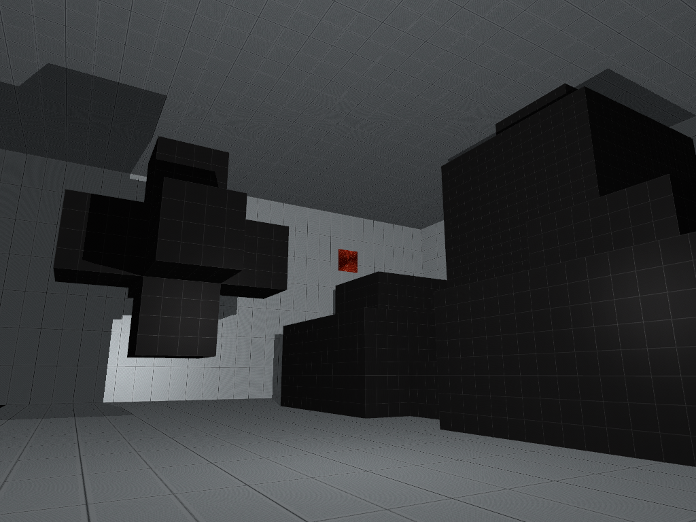

# OpenGL game demo
Simple 3D game engine

## Features
* FPS camera
* Collision detection and gravity
* Phong lighting model
* Shadow mapping
* Modern C++ wrappers for OpenGL
* Map loading from `.bmp`

## Setup
#### Windows
1. Install [Visual Studio](https://www.visualstudio.com/). You may need to set
path to `MSBuild.exe` in `Makefile`. For Visual Studio Community 2017 default location is
`C:\Program Files (x86)\Microsoft Visual Studio\2017\Community\MSBuild\15.0\Bin\MSBuild.exe`.

2. Install [CMake](https://cmake.org/) and add `cmake.exe` to `PATH`.
Default location is `C:\Program Files\CMake\bin`.

#### Linux
1. Install [CMake](https://cmake.org/).
2. Install [XOrg](https://www.x.org/wiki/) development package. 
For example `xorg-dev` if you are using `Debian` or `Ubuntu`.

## Build
Use `Makefile` CMake wrapper to automatically build everything and place game
files in `install.out` directory.

#### Windows
`.\toolchain\make.exe`
#### Linux
`make`

## Thirdparty

Functionality           | Library
----------------------- | ------------------------------------------
OpenGL Function Loader  | [glad](https://github.com/Dav1dde/glad)
Windowing and Input     | [glfw](https://github.com/glfw/glfw)
OpenGL Mathematics      | [glm](https://github.com/g-truc/glm)
Texture Loading         | [stb](https://github.com/nothings/stb)
